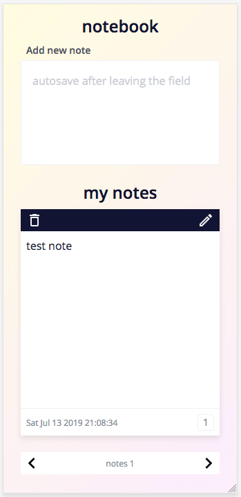

# Simple editor ⇒ notebook

It supposed to be a simple editor but let's make a notebook - or so

## Project assumptions

- one textarea to take a note
- save the note after textarea out of focus
- save in localStorage as a flat array of objects
- when a note is saved, the note list will be created as a slideshow on the website
- the note list is made after the website is loaded - if the notes exist in the localStorage
- maybe add edit and delete notes option

## Figma design


## Website 🚀

[go to the website](https://rogreyroom.github.io/simple-editor/)



## Build with

- [gulp-starter](https://github.com/rogreyroom/gulp-starter),
- [pdkit](https://pdkit.co/)
- [hammerjs](https://hammerjs.github.io/) touch gestures library

## Deploy

To deploy public folder to **gh-pages** brunch

```git
> git checkout gh-pages
> git checkout [master/feature-branch] -- 'public/**'
> git rm -f -r --ignore-unmatch ./**
> git mv -f public/** ./
> git commit . -m "build: website deploy `date +\"%Y-%m-%d\"`"
```

## Version

v.1.0.0

## Author

Robert Adamczewski

## License

This project is licensed under MIT License - see the [LICENSE.md](./LICENSE.md) file for details.
